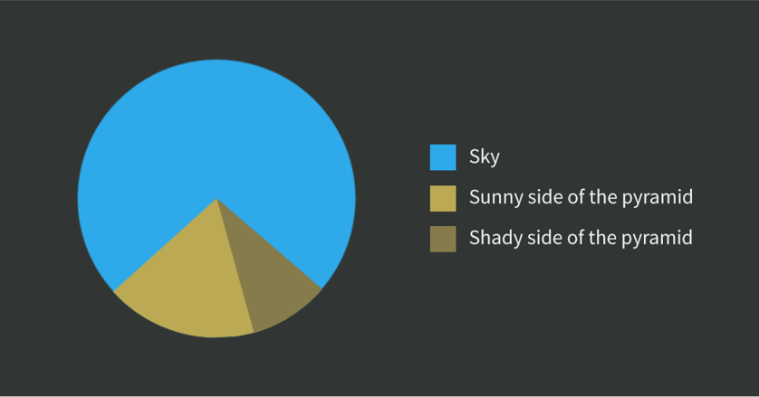

```{r setup, include = FALSE}

options(htmltools.dir.version = FALSE)
# knitr::opts_chunk$set(echo = FALSE, warning = FALSE, message = FALSE, comment = "")
knitr::opts_chunk$set(echo = FALSE, comment = "")

library(tidyverse)
library(knitr)

```

# Polls Before an Election

## First Go: A Pie Chart

```{r data}

polls <- tribble(
  ~poll, ~Candidate_1, ~Candidate_2, ~Candidate_3, ~Candidate_4, ~Candidate_5,
  "July", 17, 18, 20, 22, 23,
  "August", 20, 20, 19, 21, 20,
  "September", 23, 22, 20, 18, 17
)

polls <- polls %>% 
  pivot_longer(cols = -poll, names_to = "Candidate", values_to = "Share") %>% 
  # gather(-Umfrage, key = Kandidat, value = Anteil) %>% 
  mutate(Candidate = str_remove(Candidate, "Candidate_"))

# kable(polls)

```

.pull-left[

```{r pie-1, echo = TRUE, eval = FALSE}

theme_set(theme_void(base_size = 18))  #<<

polls %>% 
  filter(poll == "July") %>% 
  ggplot(aes(x = "", y = Share, fill = Candidate)) +
  geom_col() +                   #<<
  coord_polar(theta = "y", start = 0) +   #<<
  labs(title = "Voting Shares of 5 Candidates in July Poll")

```

]

.pull-right[

```{r pie-1-exec, ref.label = "pie-1", echo = FALSE, fig.height = 6, fig.width = 7}
```

]

What if we wanted to compare three polls?

---

# Comparing Three Polls

.pull-left[

```{r pie-2, echo = TRUE, eval = FALSE}

polls <- polls %>% 
  mutate(poll = fct_inorder(poll))  #<<

polls %>% 
  ggplot(aes(x = "", y = Share, fill = Candidate)) +
  geom_col() +
  coord_polar(theta = "y", start = 0) +
  facet_wrap(vars(poll)) +       #<<
  labs(title = "Voting Shares of 5 Candidates") +
  theme(legend.position = "bottom")

```

]

.pull-right[
```{r pie-2-exec, ref.label = 'pie-2', fig.height = 3, fig.width = 6}

```

]

Pie charts are not suited for this kind of comparison.

Last words on pie charts ...

---

# Pie Charts, for the Last Time

.pull-left[

### Hadley's Favorite Pie Chart

```{r hadleys-favorite, fig.height = 5}

df <- data.frame(
  Key = c("does not resemble", "resembles"),
  value = c(20, 80)
)
ggplot(df, aes(x = "", y = value, fill = Key)) +
  geom_col(width = 1) +
  scale_fill_manual(values = c("red", "yellow")) +
  coord_polar("y", start = pi / 3) +
  labs(title = "Pac man",
       caption = "Source: ?coord_polar")

rm(df)

```

]

--

.pull-right[

### My Favorite Pie Chart

```{r my-favorite}



```

Source: https://www.datapine.com/blog/notorious-pie-charts/

]


---

# Better: Bar Charts

.pull-left[

```{r bar-1, echo = TRUE, eval = FALSE}

theme_set(theme_bw(base_size = 18))   #<<

ggplot(polls, aes(x = Candidate, y = Share,
                  fill = Candidate)) +
  geom_col() +            #<<
  facet_wrap(~ poll) +    #<<
  labs(title = "Voting Shares of 5 Candidates") +
  theme(legend.position = "none")

```

]

.pull-right[
```{r bar-1-exec, ref.label = 'bar-1'}

```

]

Next: Reducing width of bars

---

# Reducing Bar Width

.pull-left[

```{r bar-2, echo = TRUE, eval = FALSE}

ggplot(polls, aes(x = Candidate, y = Share,
                  fill = Candidate)) +
  geom_col(width = 0.8) +            #<<
  facet_wrap(vars(poll)) +           #<<
  labs(title = "Voting Shares of 5 Candidates") +
  theme(legend.position = "none")

```

]

.pull-right[
```{r bar-2-exec, ref.label = 'bar-2'}

```

]

How well can we read the percentages from the chart?

---

# Labelling the Bars

.pull-left[

```{r bar-3, echo = TRUE, eval = FALSE}

ggplot(polls, aes(x = Candidate, y = Share,
                  fill = Candidate)) +
  geom_col(width = 0.8) +
  geom_text(aes(y = Share + 1,  #<<
                label = paste0(Share, "%"))) +   #<<
  facet_wrap(vars(poll)) +           #<<
  labs(title = "Voting Shares of 5 Candidates") +
  theme(legend.position = "none")

```

]

.pull-right[
```{r bar-3-exec, ref.label = 'bar-3'}

```

]

Alternative: Work on y axis

---

# Improving Y Axis Breaks

.pull-left[

```{r bar-4, echo = TRUE, eval = FALSE}

ggplot(polls, aes(x = Candidate, y = Share,
                  fill = Candidate)) +
  geom_col(width = 0.8) +
  facet_wrap(vars(poll)) +
  scale_y_continuous(breaks = seq(0, 24, by = 4),      #<<
      labels = scales::label_percent(   #<<
               scale = 1, accuracy = 1)) + #<<
  labs(title = "Voting Shares of 5 Candidates") +
  theme(legend.position = "none")

```

]

.pull-right[
```{r bar-4-exec, ref.label = 'bar-4'}

```

]

We can improve readability more by moving grid lines to the front.

---

# Make Grid Lines Cut Through Bars

.pull-left[

```{r bar-5, echo = TRUE, eval = FALSE}

ggplot(polls, aes(x = Candidate, y = Share,
                  fill = Candidate)) +
  geom_col(width = 0.8) +
  facet_wrap(vars(poll)) +
  scale_y_continuous(breaks = seq(0, 24, by = 4),      
      labels = scales::label_percent(
               scale = 1, accuracy = 1)) + 
  labs(title = "Voting Shares of 5 Candidates") +
  theme(legend.position = "none",
        panel.ontop = TRUE, #<<
        panel.background = element_rect(fill = NA), #<<
        panel.grid.major.x = element_blank() #<<
        )

```

]

.pull-right[
```{r bar-5-exec, ref.label = 'bar-5'}

```

]

Can we change the facet labels?

---

# Adjusting Facet Labels

.pull-left[

```{r bar-6, echo = TRUE, eval = FALSE}

ggplot(polls, aes(x = Candidate, y = Share,
                  fill = Candidate)) +
  geom_col(width = 0.8) +
  facet_wrap(vars(poll)) +
  scale_y_continuous(breaks = seq(0, 24, by = 4),      
      labels = scales::label_percent(
               scale = 1, accuracy = 1)) + 
  labs(title = "Voting Shares of 5 Candidates") +
  theme(legend.position = "none",
        panel.ontop = TRUE,
        panel.background = element_rect(fill = NA),
        panel.grid.major.x = element_blank(),
        strip.text = element_text(color = "white", #<<
                        face = "bold", size = 14), #<<
        strip.background = element_rect(  #<<
                        fill = "grey50") #<<
        )

```

]

.pull-right[
```{r bar-6-exec, ref.label = 'bar-6'}

```

]

Do we have a story to tell?

---

# Storytelling

## Highlighting Specific Information

.pull-left[

```{r bar-7, echo = TRUE, eval = FALSE}

ggplot(polls, aes(x = Candidate, y = Share,
                  fill = Candidate)) +
  geom_col(width = 0.8,
           fill = rep(c("grey70", "grey70", #<<
            "darkgreen", "salmon2", "grey70"), 3)) + #<<
  facet_wrap(vars(poll)) +
  scale_y_continuous(breaks = seq(0, 24, by = 4),      
      labels = scales::label_percent(
               scale = 1, accuracy = 1)) + 
  labs(title = "Voting Shares of 5 Candidates") +
  theme(legend.position = "none",
        panel.ontop = TRUE,
        panel.background = element_rect(fill = NA),
        panel.grid.major.x = element_blank(),
        strip.text = element_text(color = "white",
                        face = "bold", size = 14),
        strip.background = element_rect(
                        fill = "grey50")
        )

```

]

.pull-right[
```{r bar-7-exec, ref.label = 'bar-7'}

```

]

---

# Bonus: Animation

```{r data-5-months}

data_new <- tribble(
  ~poll, ~Candidate_1, ~Candidate_2, ~Candidate_3, ~Candidate_4, ~Candidate_5,
  "October", 19, 19, 21, 21, 20,
  "November", 17, 17, 25, 21, 20
) %>% 
  pivot_longer(cols = -poll, names_to = "Candidate", values_to = "Share") %>% 
  mutate(Candidate = str_remove(Candidate, "Candidate_"))

polls2 <- polls %>% 
  bind_rows(data_new) %>% 
  mutate(poll = fct_inorder(poll))

```

.pull-left[

```{r bar-animated, echo = TRUE, eval = FALSE}

ggplot(polls2, aes(x = Candidate, y = Share,
                  fill = Candidate)) +
  geom_col(width = 0.8,
           fill = rep(c("grey70", "grey70",
            "darkgreen", "salmon2", "grey70"), 5)) +
  # facet_wrap(vars(poll)) + #<<
  gganimate::transition_states(poll) + #<<
  scale_y_continuous(breaks = seq(0, 24, by = 4),      
      labels = scales::label_percent(
               scale = 1, accuracy = 1)) + 
  labs(title = "Voting Shares of 5 Candidates",
       subtitle = "Poll: {closest_state}") + #<<
  theme(legend.position = "none",
        panel.ontop = TRUE,
        panel.background = element_rect(fill = NA),
        panel.grid.major.x = element_blank(),
        strip.text = element_text(color = "white",
                        face = "bold", size = 14),
        strip.background = element_rect(
                        fill = "grey50")
        )
```

]

.pull-right[
```{r bar-animated-exec, ref.label = 'bar-animated'}

```

]

---

class: center, middle

# Thanks!

### Youtube: StatistikinDD

### Twitter: @StatistikinDD

### github: fjodor

Slides created via the R package [**xaringan**](https://github.com/yihui/xaringan).

The chakra comes from [remark.js](https://remarkjs.com), [**knitr**](https://yihui.org/knitr), and [R Markdown](https://rmarkdown.rstudio.com).

Thanks to **Yihui Xie** for *{knitr}* and *{xaringan}* and **Garrick Aden-Buie** for *{xaringanthemer}*.