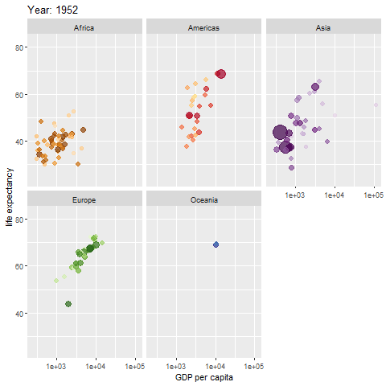

```{r setup, include = FALSE}

options(htmltools.dir.version = FALSE)
knitr::opts_chunk$set(echo = FALSE, warning = FALSE, message = FALSE, comment = "")

# library(tidyverse)

# From https://cran.r-project.org/web/packages/xaringanthemer/vignettes/xaringanthemer.html
library(xaringanthemer)
style_mono_accent(
  base_color = "#1c5253",
  header_font_google = google_font("Josefin Sans"),
  text_font_google   = google_font("Montserrat", "300", "300i"),
  code_font_google   = google_font("Fira Mono"),
  outfile = "libs/_css/xaringan-themer.css"
)

```


<!-- # Presenting Data Analyses: Why I don't use Powerpoint -->

<!-- ### 1. Powerpoint Isn't Bad! -->
<!-- ### 2. Why I Prefer Other Tools -->
<!-- ### 3. Automation & Reproducibility -->
<!-- ### 4. File Formats: Options & Limitations -->
<!-- ### 5. File Sizes -->
<!-- ### 6. Summary -->

<!-- --- -->

# Warum ich andere Formate bevorzuge

<br>

* ### Automatisierung und Reproduzierbarkeit

* ### Dateiformate: HTML vs. Powerpoint

* ### Dateigrößen

---

# Powerpoint ist nicht schlecht!

<br>
<br>

.pull-left[
* ### Einfach zu nutzen

* ### Gut geeignet für Präsentationen

* ### Viele praktische Möglichkeiten
]

--

.pull-right[

Quelle: https://giphy.com/
]
---

# Automatisierung / Reproduzierbarkeit

## Alles an einem Platz

.pull-left[
* ### Quelldatei: Programmcode  
erzeugt Diagramme, Tabellen, sogar Textmodule

* ### Kein Copy & Paste
  + Fehlerquellen reduzieren
  + Arbeitszeit sparen
  + Nur eine Datei aktuell halten
]

--

.pull-right[

.center[https://www.r-project.org]

]

---

# Automatisierung / Reproduzierbarkeit

### Folien programmatisch erstellen

.pull-left[
Änderungen in der Datenanalyse werden **automatisch** auf die Präsentation übertragen:

* Änderungen an den Daten

* Anderungen in der Datenanalyse
  + Anpassungen an Modellen
  + Änderungen an Kennzahlen (KPIs)
  + Stil-Anpassungen: Schriftarten, Farbskalen, Bildunterschriften etc.
]

--

.pull-right[

]

---

# Dateiformate

### Das *geht* in Powerpoint

.pull-left[
```{r gapminder-animation, out.height = "50%", out.width = "80%"}

```
]

.pull-right[
* Animation der berühmten **Gapminder**-Daten
* Tipp: **Hans Rosling**s Youtube-Videos  
<br>
* Erstellt mit **gganimate**  
von ** Thomas L. Pedersen**
* Quelle: https://gganimate.com/
]

---

# Dateiformate

### Das *geht nicht* in Powerpoint

.pull-left[

```{r plotly-gapminder}

library(plotly)
library(gapminder)

data(gapminder)

fig <- gapminder %>%
  plot_ly(
    x = ~gdpPercap, 
    y = ~lifeExp, 
    size = ~pop, 
    color = ~continent, 
    frame = ~year, 
    text = ~country, 
    hoverinfo = "text",
    type = 'scatter',
    mode = 'markers'
  )
fig <- fig %>% layout(
    xaxis = list(
      type = "log"
    )
  )

library(widgetframe)
frameWidget(fig, width = "100%", height = "40%")

```

]

.pull-right[
* Interaktivität erfordert **Javascript**

* Erstellt mit dem **plotly**-Paket in R  
von **Carson Sievert**
* Quelle: https://plotly.com/r/animations/
]

---

# Dateiformate

### Das *geht nicht* in Powerpoint

```{r DT-datatable}

library(DT)
tab <- datatable(gapminder,
                 filter = "top",
                 options = list(pageLength = 7))
frameWidget(tab)

```

---

# Dateiformate

<br>

.pull-left[
.content-box-grey[
## HTML

**Javascript** ermöglicht Interaktivität

* Mouse-Over-Effekte, in Grafiken hineinzoomen
* Tabellen mit Paginierung, Sortier- und Filter-Optionen

 ]
]

.pull-right[
.content-box-gray[
## Powerpoint

* Keine direkte Javascript-Unterstützung
* Begrenzte Interaktivität
(z. B. Schaltflächen, Animationen & Videos)

 ]
]

---

# Dateigrößen

* ### Powerpoint-Präsentationen können sehr groß werden
--> Spürbare Ladezeiten

* ### HTML-Formate können ausgelagerte Dateien einbinden
--> Schneller Start der Präsentation; Dateien werden nach Bedarf geladen

* ### Diese Präsentation (HTML-Datei) umfasst `r utils:::format.object_size(file.info("Why-not-Powerpoint.html")$size, "auto")`.

---

class: center, middle

# Vielen Dank!

### Youtube: StatistikinDD

### Twitter: @StatistikinDD

### github: fjodor

Folien erstellt mit dem R-Paket [**xaringan**](https://github.com/yihui/xaringan).

Das *Chakra* stammt von [remark.js](https://remarkjs.com), [**knitr**](https://yihui.org/knitr), und [R Markdown](https://rmarkdown.rstudio.com).

Dank an **Yihui Xie** für *{knitr}* und *{xaringan}* sowie **Garrick Aden-Buie** für *{xaringanthemer}*.
