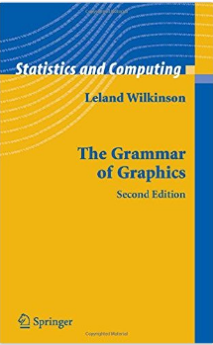

```{r setup, include = FALSE}

options(htmltools.dir.version = FALSE)
knitr::opts_chunk$set(echo = FALSE, warning = FALSE, message = FALSE, comment = "")

library(tidyverse)

# From https://cran.r-project.org/web/packages/xaringanthemer/vignettes/xaringanthemer.html
library(xaringanthemer)
style_mono_accent(
  base_color = "#1c5253",
  header_font_google = google_font("Josefin Sans"),
  text_font_google   = google_font("Montserrat", "300", "300i"),
  code_font_google   = google_font("Fira Mono"),
  outfile = "libs/_css/xaringan-themer.css"
)

theme_set(theme_gray(base_size = 14))

```

# The Grammar of Graphics: Background

.pull-left[

### Book: Leland Wilkinson (1999)

]

--

.pull-right[
### Paper by Hadley Wickham

[A layered grammar of graphics](http://vita.had.co.nz/papers/layered-grammar.html)

* Published in the *Journal of Computational and Graphical Statistics*  
vol. 19, no. 1, pp. 3-28, 2010
* Full text available for download (PDF), 26 pages
]

---

# The Grammar of Graphics: Key Ideas

## Layers and Aesthetics

* Graphics are built from layers of grammatical elements

* Variables are mapped onto aesthetics

* Seven *Layers* in total

--

## Three Basic Layers

* Data
* Aesthetics: Scales that we map data onto
* Geometries: Visual elements that display data

---

# Three Basic Layers

### 1. Data

.pull-left[

### 2. Aesthetics

* x axis, y axis
* color, fill
* size
* alpha (opacity)
* shape
* line type, line width
]

--

.pull-right[
### 3. Geometries

* points
* lines
* bars
* histogram
* boxplot
* ...
]

---

# ggplot2: A Minimal Example

## The first layer: Data

.pull-left[
```{r min-example-1, echo = TRUE, eval = FALSE}

library(tidyverse)
data(diamonds)

ggplot(data = diamonds)   #<<

```

### Data alone does not produce a plot yet ...

]

.pull-right[
```{r min-example-1-exec, echo = FALSE, eval = TRUE, ref.label = "min-example-1"}
```
]


---

# ggplot2: A Minimal Example

## The second layer: Aesthetics

.pull-left[
```{r min-example-2, echo = TRUE, eval = FALSE}

ggplot(diamonds,
       aes(x = cut))   #<<

```

### Data and aesthetics do not suffice ...

]

.pull-right[
```{r min-example-2-exec, echo = FALSE, eval = TRUE, ref.label = "min-example-2"}
```
]

---

# ggplot2: A Minimal Example

## Adding a Geometry

.pull-left[
```{r min-example-3, echo = TRUE, eval = FALSE}

ggplot(diamonds, aes(x = cut)) +
  geom_bar()   #<<

```

### Now we get a valid plot!

]

.pull-right[
```{r min-example-3-exec, echo = FALSE, eval = TRUE, ref.label = "min-example-3"}
```
]

---

# NB: Label your axes!


* Source: xkcd 833 "Convincing"  
* https://xkcd.com/
* *"A webcomic of romance, sarcasm, math, and language"*

---

# ggplot2: Minimal Example, updated

.pull-left[
```{r min-example-labels, echo = TRUE, eval = FALSE}

ggplot(diamonds, aes(x = cut)) +
  geom_bar() +
  labs(title = "Quality of cuts", #<<
       x = "Cut", y = "N", #<<
       caption = "Diamonds dataset, ggplot2") #<<

```

### No need to ruin a relationship ...

]

.pull-right[
```{r min-example-labels-exec, echo = FALSE, eval = TRUE, ref.label = "min-example-labels"}
```
]

---

# ggplot2: More Layers

Next to the necessary basic layers, ...

.content-box-grey[
**1. Data**  
**2. Aesthetics**  
**3. Geometries**  
]

... there are four advanced / optional layers:

.content-box-gray[
**4. Facets: Display subgroups in separate plotting areas**  
**5. Statistical transformations**  
**6. Coordinate systems**  
**7. Themes: *Non data ink* **  
]

---

class: center, middle

# Thanks!

### Youtube: StatistikinDD

### Twitter: @StatistikinDD

### github: fjodor

Slides created via the R package [**xaringan**](https://github.com/yihui/xaringan).

The chakra comes from [remark.js](https://remarkjs.com), [**knitr**](https://yihui.org/knitr), and [R Markdown](https://rmarkdown.rstudio.com).

Thanks to **Yihui Xie** for *{knitr}* and *{xaringan}* and **Garrick Aden-Buie** for *{xaringanthemer}*.